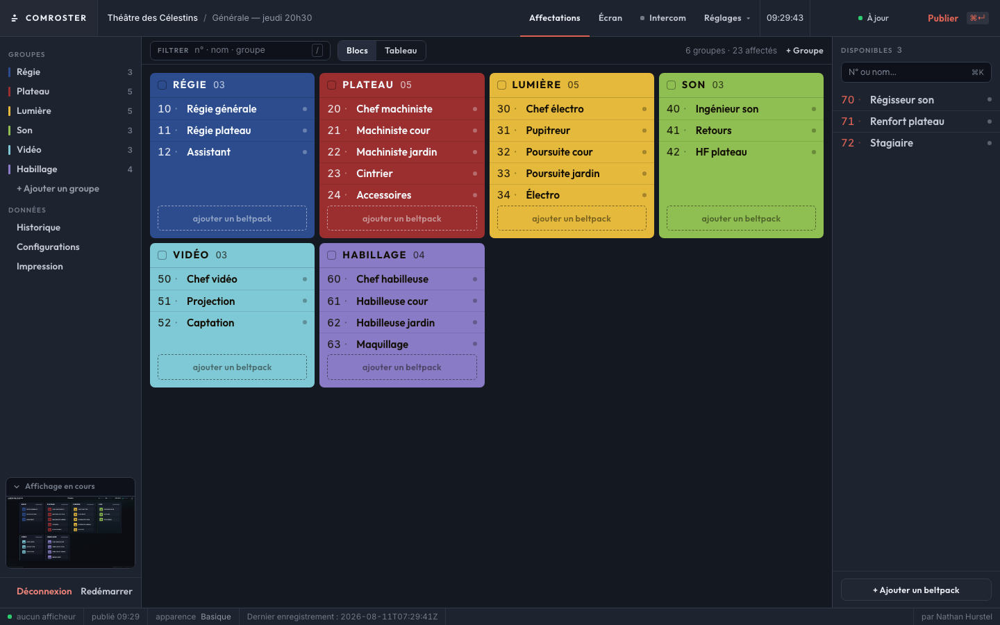
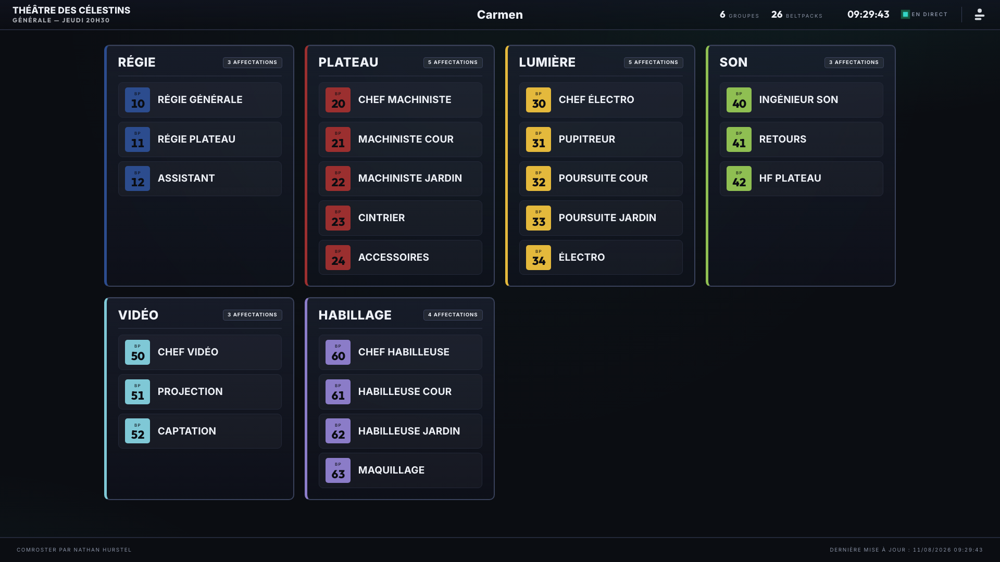
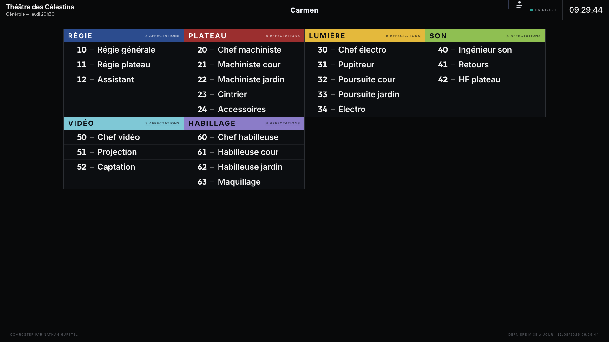
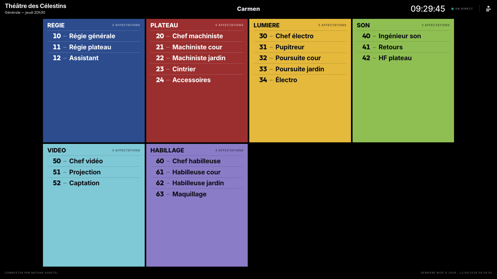

# ComRoster

Tableau d'affectation dynamique des beltpacks d'intercom (Riedel Bolero) pour spectacles
et concerts. Une **interface d'administration** prépare l'affectation (brouillon) ; un
**affichage TV temps réel** diffuse l'état **publié** vers la régie via Server-Sent Events.

Principe directeur : deux états distincts. L'admin travaille sur un brouillon ; rien
n'apparaît à l'écran tant qu'il n'a pas cliqué « Publier ».

Le **rôle** (« Régie », « Lumière »…) caractérise le **numéro de beltpack** : le système
mémorise la correspondance n° → rôle et la propose à la saisie.

## Pile technique

Python 3.12 · Flask · Flask-WTF (CSRF) · Flask-Limiter (anti-bruteforce) · Werkzeug
(hashing) · SSE (`EventSource`) · drag-and-drop HTML5 natif (zéro dépendance JS) ·
trois apparences d'écran commutables × deux modes de luminosité · pytest. Persistance
par fichiers JSON plats avec écriture atomique. Aucun SGBD.

## Installation

```bash
python3.12 -m venv .venv
.venv/bin/pip install -r requirements.txt
```

## Variables d'environnement

| Variable | Rôle | Défaut |
|----------|------|--------|
| `FLASK_SECRET_KEY` | Clé de session — **obligatoire en prod** (refus de démarrer sinon) | — |
| `DATA_DIR` | Répertoire des fichiers d'état | répertoire courant |
| `PORT` | Port d'écoute (dev) | `8080` |
| `FLASK_DEBUG` | Mode debug (`true`/`false`) — désactive `Secure` sur le cookie | `false` |
| `COMROSTER_ANTENNA_TIMEOUT` | Délai (s) des requêtes vers l'antenne Bolero | `5` |
| `COMROSTER_BIND` | Adresse:port d'écoute gunicorn (mettre `0.0.0.0:8080` en Pi autonome) | `127.0.0.1:8080` |
| `COMROSTER_INSECURE_COOKIE` | Désactive le flag `Secure` du cookie (LAN fermé sans TLS) — **sans** activer le debug | `false` |
| `COMROSTER_BEHIND_PROXY` | Fait confiance à `X-Forwarded-For` (rate-limit du login derrière Nginx) | `false` |
| `COMROSTER_SSE_MAX` | Plafond de flux SSE simultanés. Un tiers est réservé aux onglets d'admin (`?role=admin`) ; les deux tiers restants sont **garantis aux écrans** | `12` |
| `COMROSTER_VIEWER_PORT` | Port de l'agent afficheur (mode 2 Pi) | `8081` |
| `COMROSTER_VIEWER_CODE` | Impose le code d'appariement de l'agent afficheur au lieu d'en tirer un au sort | tiré au sort |

Générer une clé : `python -c "import secrets; print(secrets.token_hex(32))"`.

## Lancement

**Développement** (le plus simple) :
```bash
./run-dev.sh
```
Le script active `FLASK_DEBUG=true` : la factory fournit alors une clé de session de dev
et désactive le flag `Secure` du cookie (nécessaire en HTTP local). Équivalent manuel :
```bash
FLASK_DEBUG=true DATA_DIR=./instance python app.py
```
> Sans `FLASK_DEBUG` ni `FLASK_SECRET_KEY`, l'app **refuse de démarrer** (garde prod voulue).

**Production (un seul worker — le broker SSE est en mémoire) :**
```bash
FLASK_SECRET_KEY=<clé> DATA_DIR=/opt/comroster/instance \
  .venv/bin/gunicorn -c gunicorn.conf.py app:app
```
Derrière Nginx : voir [deploy/nginx.conf](deploy/nginx.conf) — `proxy_buffering off` sur
`/events` est **indispensable** au SSE. Service systemd : [deploy/comroster.service](deploy/comroster.service).

> **HTTPS requis en prod.** Le cookie de session est marqué `Secure` : sans TLS, la connexion
> admin échoue silencieusement. La config Nginx fournie redirige 80 → 443 et termine le TLS.
> Sur un LAN de régie fermé sans certificat, lancer gunicorn avec `FLASK_DEBUG=true` désactive
> le flag `Secure` (à réserver à ce cas).

Le mot de passe de l'antenne Bolero est **chiffré au repos** (Fernet, clé dérivée de
`FLASK_SECRET_KEY`) dans `antenna.json` — dépendance `cryptography`. Changer la clé de session
rend les identifiants antenne illisibles (ils sont alors ignorés, sans erreur).

### Raspberry Pi (mode appliance)

Cible de déploiement principale. Installation **en une commande** d'un Pi autonome
(serveur + affichage kiosk, démarrage auto au boot, relance auto) :

```bash
git clone <url> ~/comroster && cd ~/comroster
sudo deploy/setup-pi.sh && sudo reboot
```

Guide complet (prérequis, admin sur le LAN, mise à jour, robustesse) :
**[deploy/raspberry-pi.md](deploy/raspberry-pi.md)**.

Le `/display` est optimisé pour ce matériel : polices **auto-hébergées** (aucun appel CDN,
hors-ligne), auto-scroll en `transform` **composé GPU** (pas de repaint CPU continu),
**anti-veille** (Screen Wake Lock + blanking OS). Détails kiosk : [deploy/kiosk.md](deploy/kiosk.md).

Flags utiles en appliance : `COMROSTER_BIND` (défaut `127.0.0.1:8080`) et
`COMROSTER_INSECURE_COOKIE` (désactive le cookie `Secure` pour un LAN fermé sans TLS).

### Versions

Le numéro affiché (onglet Santé, pied de l'écran de régie, écran de démarrage) n'est
jamais saisi : `deploy/setup-pi.sh` le dérive de `git describe` et le grave dans
`comroster/VERSION`, fichier généré et non suivi par git.

- **MAJEUR** — la mise à jour exige une action humaine ; concrètement, quand
  `backup.VERSION` change et qu'une archive ancienne ne se restaure plus.
- **MINEUR** — une fonction visible en plus.
- **CORRECTIF** — une correction, rien de neuf.

L'onglet Santé affiche le détail complet (`v1.4.0+7 · 9f3c1a2 · 2026-07-29`) ; l'écran de
régie, vu par le client, n'affiche que `v1.4`.

⚠️ Sous l'overlay racine en lecture seule (`deploy/readonly-fs.sh`), cette gravure est
volatile — `comroster/VERSION` vit sur la racine, pas dans `instance/`. Détail et
procédure de mise à jour : [deploy/raspberry-pi.md](deploy/raspberry-pi.md), section
« Mise à jour ».

## Premier démarrage

1. Ouvrir `/admin/setup` → définir le mot de passe admin (4 caractères min.).
2. **Noter le code de récupération** affiché une seule fois (sert à réinitialiser le mot de passe).
3. `/admin` : créer les groupes (canaux), ajouter les beltpacks (n° + rôle),
   glisser-déposer dans les groupes, puis **Envoyer à l'affichage**.
4. Ouvrir `/display` sur l'écran de régie — mise à jour en direct à chaque publication.


*L'administration : les groupes au centre, la réserve à droite (beltpacks non affectés),
le témoin de l'écran publié en bas à gauche. La barre du bas dit l'essentiel en continu —
combien d'afficheurs sont branchés, l'heure de la dernière publication, l'apparence en
cours. Rien de ce qui est visible ici n'est encore à l'écran de régie tant qu'on n'a pas
cliqué **Publier**.*

## Apparences de l'écran

`/display` se décline en trois **apparences** (réglage « Apparence » dans l'admin), chacune
disponible en mode sombre et clair. Le choix est stocké dans l'état publié : il change à chaud,
sans recharger l'écran de régie.

| Valeur | Nom | Parti pris |
|--------|-----|-----------|
| `basique` | Basique | **Défaut.** Cartes en verre dépoli, accent turquoise, capitales. |
| `lineaire` | Linéaire | Tableau réglé, à-plat. La couleur du groupe se limite au bandeau de tête. Rôles nettement plus gros (pas de cadre à financer). |
| `grille` | Grille | Mosaïque pleine : le groupe **est** une surface colorée. Le plus lisible de loin. |


*Basique — cartes en verre dépoli, numéro de beltpack en pastille colorée.*


*Linéaire — la couleur se limite au bandeau de tête ; les rôles gagnent la place du cadre.*


*Grille — le groupe est une surface pleine. L'encre bascule du noir au blanc selon la
luminance de la teinte : ici noire sur le jaune, le vert et le cyan, blanche sur le bleu,
le grenat et le mauve.*

> Les trois captures sortent du même plateau, à **1920×1080** (la résolution du kiosk Pi),
> et se régénèrent par `.venv/bin/python tools/captures.py`.

Techniquement : un attribut `data-skin` sur `<body>` ; `basique` vit dans
[display.css](static/css/display.css), les autres dans [skins.css](static/css/skins.css). Les
feuilles sont toutes chargées en permanence, puisque l'apparence peut changer en direct par SSE.

> **`grille` pose du texte sur la couleur du groupe.** L'encre (noire ou blanche) est choisie au
> rendu d'après la luminance relative sRGB. Pour garantir la lisibilité, le choix de couleur d'un
> groupe se fait dans une **palette bornée** de 24 teintes calibrées (contraste ≥ 4.5:1 avec l'encre
> dans les deux modes de luminosité) — pas un sélecteur libre, qui laissait choisir des teintes
> médiocres. La règle d'encre est partagée par l'écran et l'admin ([ink.js](static/js/ink.js)).

**Aperçu** — un **témoin permanent** en surimpression, coin bas-droit, montre l'état **publié** et
se rafraîchit à chaque publication. À cette taille le texte est illisible par construction : on y
lit la structure (colonnes, couleurs de groupes, densité), pas le contenu. Cliquer dessus ouvre le
grand aperçu ; un clic à côté le referme. Le bandeau replie le témoin, et ce choix est mémorisé.

Les deux sont des iframes sur `/admin/preview`, c'est-à-dire la vraie page display à l'échelle —
aucun rendu parallèle, donc aucune dérive possible. Ni l'une ni l'autre n'ouvre de flux SSE
(voir ci-dessous).

> **L'aperçu est rendu en 1920×1080**, la résolution du kiosk Pi. En colonnes « Automatique », leur
> nombre dépend de la largeur en pixels (`minmax(340px, 1fr)`) : un aperçu ne peut donc être fidèle
> qu'à **une** résolution. Si votre écran de régie n'est pas en 1080p, fixez le nombre de colonnes
> — le rendu devient alors indépendant de la largeur, et l'aperçu exact partout.

## Parcours & routes

- `/admin/setup`, `/admin/login`, `/admin/recover` — comptes (public).
- `/admin` + `/api/*` — administration (session requise, CSRF sur les requêtes mutatives).
- `/admin/preview` — aperçu de l'état **publié**, session requise. Rend `display.html` avec
  `data-preview="on"` : le JS y coupe le SSE, les sondages, l'anti-veille et le défilement.
  `?scroll=1` rétablit le défilement (grand aperçu seulement — le témoin permanent reste immobile).
  Chaque flux `/events` occupe un thread et un créneau de `COMROSTER_SSE_MAX` (12 par défaut) —
  un aperçu laissé ouvert affamerait les vrais afficheurs.
- `/admin/print` — feuille d'affectation à imprimer (état publié ; `?draft=1` pour le brouillon).
  Chargée en trame dans le panneau « Impression » de l'admin, avec `?embed=1` — qui retire
  seulement son lien de retour. L'adresse reste utilisable seule (aide-mémoire terrain).
- `/admin/journal`, `/admin/health` — **redirections** vers `/admin?panneau=journal|health`.
  Journal et Santé sont des panneaux de l'administration, plus des pages : on ne quitte
  plus l'admin pour les consulter. Les adresses survivent pour les signets.
- `/display` + `/events` — affichage TV public, **lecture seule** (état publié uniquement).
  L'admin s'abonne au même flux avec `?role=admin` : elle n'est alors pas comptée comme un
  écran de régie et ne peut pas affamer les vrais écrans (un tiers du plafond lui est
  concédé, pas davantage).
- `/api/live` — état temps réel des beltpacks, **public** (l'écran de régie n'a pas de
  session) et borné à 60 requêtes/minute.

## Découverte du réseau intercom

L'assistant de connexion propose les antennes Bolero visibles sur le sous-réseau du
boîtier — plus besoin de connaître l'adresse par cœur. Cliquer un résultat **remplit** le
champ d'adresse ; la connexion reste une action explicite, mot de passe compris.

> **La saisie manuelle de l'IP reste le chemin de référence** : sur un réseau segmenté, un
> VLAN dédié ou avec une antenne hors sous-réseau, c'est le seul qui fonctionne. Le
> balayage n'accepte d'ailleurs **aucune adresse du client** — il déduit son périmètre de
> l'adresse du boîtier et refuse les plages non privées, de sorte que la garde anti-SSRF de
> `/api/antenna/connect` (littéral IP uniquement) reste entière.

## Sauvegarde du boîtier

`Sauvegarde` (barre latérale, section « Boîtier ») produit une **archive complète** :
plateau, réglages d'écran, réseau, identifiants du réseau intercom, configurations
enregistrées, mot de passe d'administration et journal. Réinjectée sur un boîtier neuf,
elle transforme une panne matérielle en incident de quelques minutes — là où l'export
`.rost`, qui ne couvre que le plateau, laissait tout le reste à refaire.

> **L'archive est toujours chiffrée** (phrase de passe, 8 caractères minimum ;
> PBKDF2-HMAC-SHA256). Elle contient le **mot de passe Wi-Fi en clair** et l'empreinte du
> mot de passe admin : non chiffrée sur une clé USB, elle serait plus dangereuse que le
> boîtier qu'elle protège. **Notez la phrase de passe avec le fichier** — sans elle
> l'archive est irrécupérable.

Deux choses ne sont **volontairement pas** sauvegardées : le carnet de bord
(`lifetime.json`), qui est l'identité du boîtier *physique* — un boîtier neuf ne doit pas
revendiquer les heures de vol du mort — et `history/`, volumineux et dérivé.

Avant d'écraser quoi que ce soit, « Examiner le contenu » **annonce** ce que l'archive
porte. Le journal, lui, est **fusionné** et non remplacé : une restauration n'efface pas
les évènements du boîtier d'accueil.

## Mot de passe d'administration

`Mot de passe` (section « Boîtier ») change le mot de passe **sans consommer le code de
récupération** — c'est toute la différence avec `/admin/recover`. Un boîtier prêté d'une
production à l'autre peut ainsi tourner sa clé sans qu'il faille rediffuser un nouveau
code à toute l'équipe.

## Impression

`Impression` (section « Données ») ouvre un **panneau** de l'administration — l'en-tête et
la latérale restent en place — qui charge `/admin/print` en trame : une conduite papier au format
**A3 portrait sur trois colonnes** par défaut, avec une colonne de visa. Les régies
travaillent sur papier, et c'est le filet quand le boîtier tombe — une feuille imprimée
survit à une panne d'alimentation. Comme l'aperçu, elle rend l'état **publié** par
défaut ; `?draft=1` imprime le brouillon.

Une barre de réglages, à l'écran seulement, pilote six choix **mémorisés** d'une
impression à l'autre :

| Réglage | Valeurs | Défaut |
|---|---|---|
| Format | A3 portrait · A3 paysage · A4 portrait · A4 paysage · A5 portrait | A3 portrait |
| Colonnes | 1 · 2 · 3 | 3 |
| Visa | colonne de signature (28 mm) | activée |
| Cases | case « Remis » à cocher | désactivée |
| Non affectés | inclure la réserve | activée |
| Un groupe par page | un saut de page par groupe (impose la colonne unique) | désactivée |

Trois détails qui se voient sur le papier et nulle part ailleurs : un groupe de plus de
douze membres peut être coupé entre deux colonnes et se **réidentifie** alors en tête de
colonne ; un bandeau d'identification est répété au pied de **chaque** page, pour qu'une
conduite qui se sépare reste lisible feuille par feuille ; et le numéro de page est posé
en boîte de marge CSS — une spécificité **Chromium**, sur Firefox et Safari c'est le pied
natif du navigateur qui le fournit.

## Réinitialisation totale (A6)

Mot de passe **et** code de récupération perdus : supprimer le fichier secret, l'app
repassera en configuration initiale au prochain accès.
```bash
rm /opt/comroster/instance/admin_secret.json
```

## Fichiers d'état (non versionnés)

Tous écrits dans `DATA_DIR` : `data_draft.json` (brouillon), `data_published.json`
(publié), `admin_secret.json` (empreintes, permissions 600), `settings.json`,
`antenna.json` (identifiants chiffrés, 600), `network.json` (**contient le mot de passe
Wi-Fi en clair**, 600), `viewer.json` et `viewer_agent.json` (mode 2 Pi),
`journal.jsonl` (évènements), `lifetime.json` (carnet de bord), `configs/`
(configurations nommées) et `history/` (instantanés des publications).

Chacun a sa ligne dans `.gitignore`, ainsi que les `.bak`/`.tmp` de l'écriture atomique —
et c'est **vérifié par un test** (`test_gitignore_couvre_tous_les_fichiers_detat`), qui
interroge les services eux-mêmes plutôt qu'une liste écrite à la main. Quatre de ces
fichiers manquaient jusqu'à l'audit du 2026-07-28, dont `network.json` et son PSK.

## Tests

Dépendances de dev (hors `requirements.txt`) : voir [requirements-dev.txt](requirements-dev.txt).
```bash
.venv/bin/pip install -r requirements-dev.txt
```

**Tests unitaires / intégration** (rapides, sans navigateur) :
```bash
.venv/bin/pytest -q
```

**Tests bout-en-bout** (navigateur Playwright headless, marqueur `e2e`, exclus par défaut) :
```bash
.venv/bin/playwright install chromium      # une fois : télécharge le navigateur
.venv/bin/pytest tests/e2e -m e2e
```
Ils démarrent un vrai serveur et valident le parcours complet (configuration → groupe →
beltpack → publication → affichage TV) dans un vrai navigateur.

**Tests JavaScript** (logique pure : modèle du brouillon, masques de sous-réseau, encre) :
```bash
npm ci        # une fois — vitest, épinglé par le lockfile
npm test
```
> Ces paquets sont **de développement uniquement**. `static/js/*.js` reste du JavaScript
> nu chargé par de simples `<script>` : rien de ce que npm installe n'atteint le boîtier,
> et l'engagement « zéro dépendance JS » porte sur le runtime.

**Couverture** (seuil plancher déclaré dans `pyproject.toml`, vérifié en CI) :
```bash
.venv/bin/coverage run -m pytest -q && .venv/bin/coverage report
```

**Rejouer le lint de la CI avec les mêmes versions d'outils** :
```bash
./deploy/lint-local.sh
```
> `ruff` et `shellcheck` sont **épinglés** (respectivement dans `requirements-dev.txt` et
> `.github/workflows/ci.yml`). Un linter dont la version diffère entre le poste et la CI
> rend le verdict local sans valeur : ça a déjà coûté deux journées au projet.
